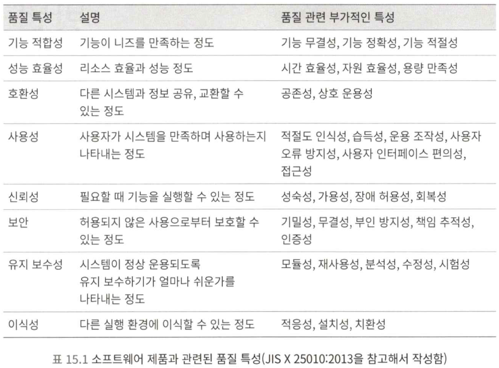
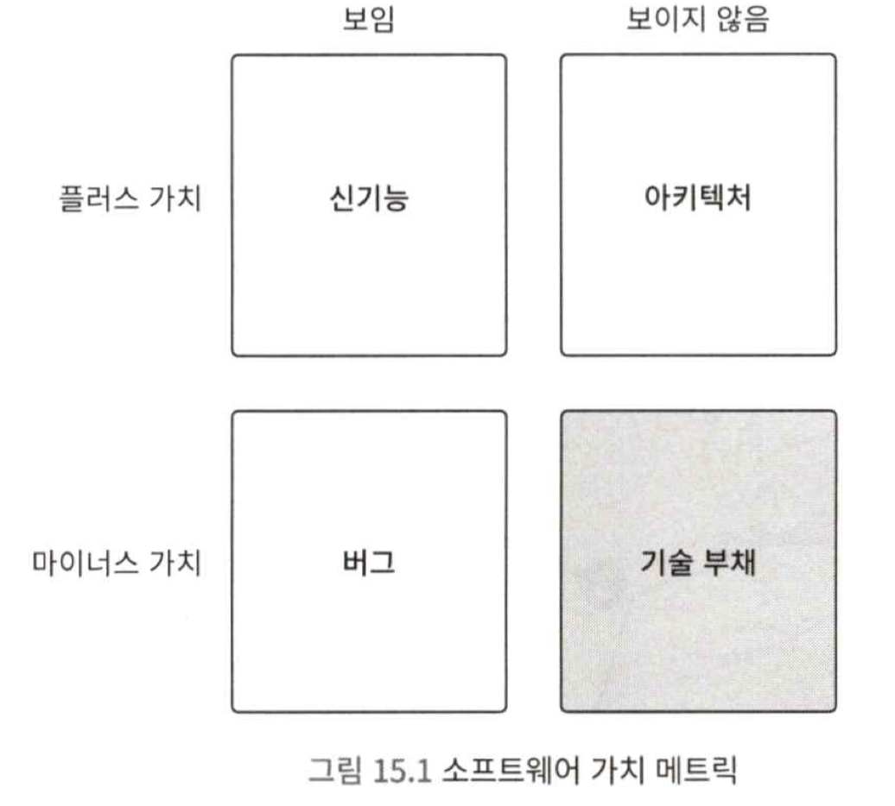
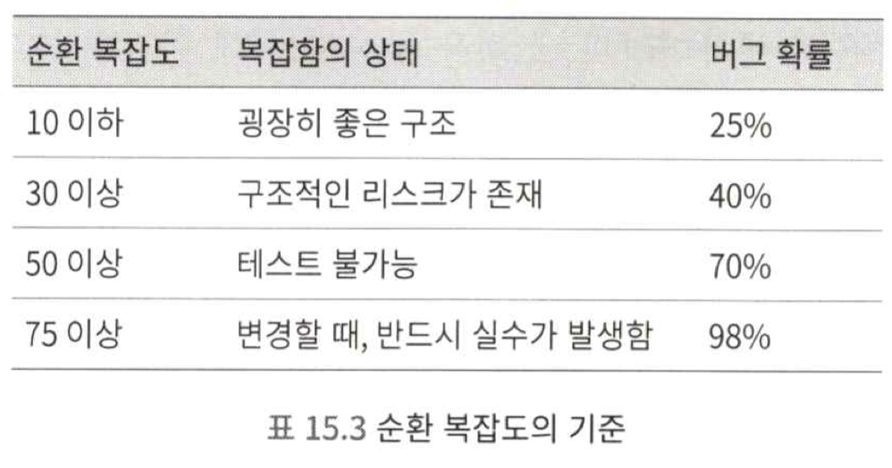

# 설계의 의의와 설계를 대하는 방법
## 이 책은 어떤 설계를 주제로 집필한 것인가?

- 소프트웨어에서 설계란, "어떤 소프트웨어의 품질 특성을 향상시키기 위한 구조를 만드는 것"이라고 말할 수 있다.
- 악마의 성질과 가장 관련 있는 품질 특성은 "유지 보수성"이다.

## 설계하지 않으면 개발 생산성이 저하된다
- 레거시 코드 : 변경하기 어렵고 버그가 생기기 쉬운 코드
- 기술 부채 : 레거시 코드가 축적되어 있는 상태
- 변경 용이성 설계를 하지 않으면 개발 생산성이 저하된다.

### 1. 개발 생산성 저하 요인 1. 버그가 발생하기 쉬운 구조
- 응집도가 낮은 구조로 인해 사양 변경 시 수정 누락이 발생하기 쉬워지고, 버그가 발생
- 코드를 이해하기 어려우므로 구현할 때 실수를 저지르기 쉬워지고, 버그가 발생
- 잘못된 값이 들어오기 쉬워지고, 버그가 발생

### 2. 개발 생산성 저하 요인 2. 가독성이 낮은 구조
- 로직의 가독성이 낮아 읽고 이해하는데 시간이 오래 걸림
- 관련 로직이 이곳저곳에 흩어져 사양 변경할 때 로직을 찾아다니느라 시간이 오래 걸림
- 잘못된 값이 들어와 보그가 발생했을 떄, 잘못된 값의 출처를 추적하기 어려워짐

### 3. 나무꾼의 딜레마
- 나무 자르는 시간을 '로직을 구현하는 시간'으로, 도끼의 날을 가는 시간을 '설계하는 시간'으로 바꿔 생각

### 4. 열심히 일했지만 생산성이 나쁨
- 성과를 내기 쉬운 구조를 설계하는 데 노력을 쏟지 않았다면, "열심히 했다"라고 이야기하기 어려울 것이다.

### 5. 국가 규모의 경제 손실
- 복잡하고 이해하기 힘든 레거시 코드는, 이로 인해 더 복잡하고 이해하기 힘든 로직을 만들어낸다.

## 소프트웨어와 엔지니어의 성장 가능성
- 소프트웨어의 성장 가능성을 높이는 것이 바로 이 책의 핵심 주제이자 의의

### 1. 엔지니어에게 자산이란 무엇인가?
- 엔지니어가 **기술력**이 있다면, 모아 놓은 돈이 없어도 어디서든 돈을 벌 수 있다.
- 레거시 코드는 이러한 자산의 축적, 즉 기술력의 성장을 방해하는 무서운 존재이다.

### 2. 레거시 코드는 발전을 막음
- 레거시 코드는 다음 사람으로 하여금 레거시 코드를 작성하게 한다.

### 3. 레거시 코드는 고품질 설계 경험을 막음
- 레거시 코드는 이미 균형이 꺠져 있어 설계를 개선하기가 힘듦
- 결국 고품질 설계 구현 경험을 쌓을 수 없으므로 설계 능력이 향상되지 않는다.

### 4. 레거시 코드는 시간을 낭비하게 만듦
- 이해하는데 시간이 오래 걸림
- 레거시 코드는 기술 향상을 막고, 엔지니어에게 정말 중요한 자산이라 할 수 있는 기술력의 축적을 막는다.

## 문제 해결하기
### 1. 문제를 인식하지 못하면 설계에 대한 생각 자체가 떠오르지 않음
### 2. 인지하기 쉬운 문제와 인지하기 어려운 문제가 있음

- 어떤 악마가 어떤 문제를 일으키는지 모른다면, 기술 부채의 존재를 인식하기 힘들다.
- 소스 코드를 독해하는 스킬과 기술 부채를 인식하는 스킬은 전혀 다르다.
### 3. 이상적인 형태를 알아야 문제를 인식할 수 있음
- 이상적인 형태가 어떤 것인지 스스로 자세하게 정의할 수 있어야, 혼자 연습할 수 있다.
- 이상이 무엇인지 알고 있다면, 현실과 비교하며 차근차근 문제를 해결할 수 있다.
### 4. 변경 용이성을 비교할 수 없는 딜레마
- 변경 용이성은 개발 생산성으로 추측할 수 있지만, 성능과 달리 곧바로 비교할 수 없다.
- 변경 용이성은 시간이 경과해야 알 수 있기 때문이다.

## 코드의 좋고 나쁨을 판단하는 지표
### 1. 실행되는 코드의 줄 수
- 코드의 줄 수가 많으면 많을수록, 너무 많은 일을 하고 있을 가능성이 높다.
- 메서드는 10줄, 클래스는 100줄 이내에 가급적 작성하는 것이 좋다.
### 2. 순환 복잡도
- 순환 복잡도는 코드의 구조적인 복잡함을 나타내는 지표이다.
- 일반적으로 15보다는 낮은게 좋다.

### 3. 응집도
- 응집도는 모듈 내부에서 데이터와 로직이 관련되어 있는 정도를 나타내는 지표이다.
- 응집도를 나타내는 메트릭으로 LCOM(Lack of Cohension in Methods)이 있다.
### 4. 결합도
- 결합도는 모듈 간의 의존도를 나타내는 지표이다.
- 결합도가 높을수록 더 넓은 범위를 고려해야 하므로, 유지보수와 사양 변경이 어렵다.
- 결합도는 분석 도구를 사용해서 계측할 수 있다.
- 결합도가 높으면 단일 책임 원칙을 위배하고 있을 수 있다.
### 5. 청크
- 인간의 단기 기억은 한 번에 3~5개의 개념만 파악할 수 있고, 이를 "매지컬 넘버 4"라고 부른다.
- 기억할 수 있는 정보 덩어리의 단위를 청크라고 부른다.
- 클래스에서 다루는 개념이 3~5개 정도가 되도록 설계하고, 이보다 큰 클래스는 작은 클래스로 분할하는 것이 좋다.

## 코드 분석을 지원하는 다양한 도구
### 1. Code Climate Quality
- `Github`와 연동하면 레포지토리에 저장된 코드의 품질 점수를 자동으로 계산해준다.
### 2. Understand
- 코드 줄 수, 복잡도, 응집도, 결합도 외에도 다양한 관점의 매트릭을 계측할 수 있다.
### 3. Visual Studio

## 설계 대상과 비용 대비 효과
- 사양 변경도 없는데, 비용을 들여 변경 용이성을 높이는 것(리팩토링)은 낭비다.
- 비용 대비 효과가 높은 부분을 노려야 한다.
### 1. 파레토 법칙(80:20 법칙)
- 소프트웨어의 처리 시간 중 80%는 소스 코드 전체의 20%가 차지한다.
- 사양이 자주 바뀌는 곳도 일부에 한정되어 있다.
- 이처럼 중요하고 사양 변경이 빈번한 곳의 설계를 개선하면, 비용 대비 효과가 높다.
### 2. 코어 도메인 : 서비스의 중심 영역
- 서비스에서 중심이 되는 비즈니스 영역을 "코어 도메인"이라고 한다.
- 설계에 비용을 투자해야 하는 곳, 비용 대비 효과가 큰 곳이다.
### 3. 중점 설계 대상 선정에는 비즈니스 지식이 필요함
- 도메인 주도 설계는 코어 도메인의 가치를 지속적으로 높이고, 서비스를 장기적으로 성장시키는 설계 방법이다.

## 시간을 다스리는 능력자 되기
- 변경 용이성 설계는 개발 생산성을 향상시킨다.
- 설계의 본질을 볼 수 있는 엔지니어는 악마의 정체를 꿰뚫어 볼 수 있는 눈, 즉 레거시 코드를 머리속에 그릴 수 있는 능력이 있다.
- 훈련하면 습득할 수 있다.
