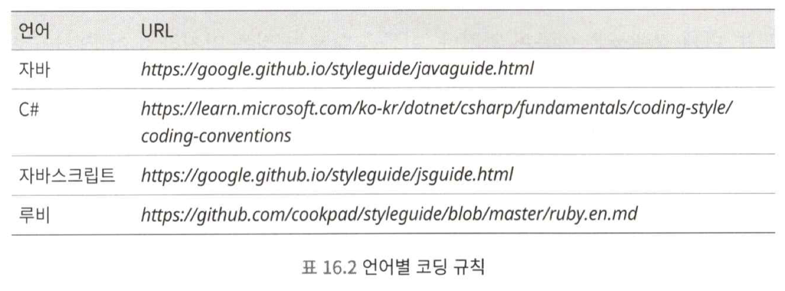

# 설계를 방해하는 개발 프로세스와의 싸움
## 커뮤니케이션
### 1. 커뮤니케이션이 부족하면 설계 품질에 문제가 발생
- 서로의 로직이 제대로 맞물리지 않아 버그로 이어지는 상황이 발생하는데, 대부분 커뮤니케이션 부족의 문제이다.
### 2. 콘웨이 법칙
- 콘웨이 법칙 : 시스템의 구조는 그것을 설계하는 조직의 구조를 닮아 간다.
- 팀 내부에서 이뤄지는 커뮤니케이션은 비용이 낮고, 팀 외부와의 커뮤니케이션은 비용이 높다는 비용 구조 자체가 시스템 구조에 영향을 준다.
### 3. 심리적 안정성
- 심리적 안정성 : 어떤 발언을 했을 때, 부끄럽거나 거절당하지 않을 것이라는 확신을 느낄 수 있는 심리 상태, 안심하고 자유롭게 발언 또는 행동할 수 있는 상태
- 심리적 안정성은 성공적인 팀을 구축할 때 매우 중요한 개념이다.
- 커뮤니케이션에 문제가 있을 때는 일단 심리적 안정성 향상에 힘쓰는 것이 좋다.

## 설계
### 1. 빨리 끝내고 싶다는 심리가 품질 저하의 함정
- 일이 바쁘면 구현을 빨리 끝내고 싶은 마음이 앞서게 되고, 그냥 동작하기만 한다면 코드를 어떻게든 구현해 버린다.
- 대부분의 소프트웨어는 한 번 만드는 것으로 끝나지 않는다. 이후 사양 변경이 계속 이루어지고, 기능은 점점 확장된다.
- 품질을 무시하고 구현하는 과정이 반복되면, 조악한 코드는 점점 더 조악해 진다.
### 2. 나쁜 코드를 작성하는 것이 좋은 코드를 작성하는 것보다 오래 걸린다.
- TDD를 사용하는 편이 전체적으로 보았을 때 더 빠르다는 결론이 나온다.
### 3. 클래스 설계와 구현 피드백 사이클 돌리기
- 사양을 변경할 떄는 최소한 메모로라도 클래스 다이어그램을 그려보면 좋다.
- 이를 기반으로 책무와 응집도 등의 관점에서 문제가 없는지, 팀과 함께 간단하게 리뷰해보라.
### 4. 한 번에 완벽하게 설계하려고 들지 말고, 사이클을 돌리며 완성하기
- 처음부터 너무 완벽하게 설계하려고 하면, 구현이 설계와 달라질 때 정신적인 충격을 많이 받는다.
- 단 한 번의 설계로 완벽한 구조를 만들어 낼 수는 없다.
- 설계 품질은 설계와 구현 피드백 사이클을 계속해서 돌리면, 조금씩 향상 된다.
### 5 .성능이 떨어질 수 있으니 클래스를 작게 나누지 말자는 맞는 말일까?
- 대부분의 경우 클래스 쪼개기가 성능에 미치는 영향은 거의 없다.
### 6. 설계 규칙을 다수결로 결정하면 코드 품질은 떨어진다.
- 다수결 또는 만장일치로 코드와 설계를 결정하려고 하면, 아무래도 수준이 낮은 쪽에 맞춰서 하향평준화되기 쉽다.
### 7. 설계 규칙을 정할 때 중요한 점
- 팀원들의 능력 차이가 큰 경우, 시니어 엔지니어처럼 설계 역량이 뛰어난 팀원이 중심이 되어 규칙을 만드는 것이 좋다.
- 각각의 설계 규칙에는 이유와 의도를 함께 적는 것이 좋다.

## 구현
### 1. 깨진 유리창 이론과 보이스카우트 규칙
- 조악하고 복잡하고 질서 없는 코드가 방치되면, 소프트웨어 전체가 점점 더 무질서해진다.
- 코드를 변경할 때, 자신이 변경하기 전보다 더 깨끗한 상태로 만들어 커밋하라.
### 2. 기존의 코드를 믿지 말고, 냉정하게 파악하기
- 의심없이 받아들이면, 이전과 같은 방식으로 레거시 코드를 더 양산하게 된다.
### 3. 코딩 규칙 사용하기
- 작성 방식에 통일성이 없다면, 코드를 읽기가 매우 힘들어진다.
- 코드를 읽기 쉽게 하려면, 코딩 규칙을 잘 지키는 것이 좋다.

### 4. 명명 규칙
- 중요한 점은 팀 전체에서 통일된 규칙을 정하고, 이를 활용해서 가독성을 높이는 것이다.

## 리뷰
### 1. 코드 리뷰 구조화하기
- 풀 리퀘스트한 코드는 '코드의 히스토리와 경위를 알고 있는 사람' 또는 '설계를 자세하게 알고 있는 사람' 이 리뷰하는 것이 좋다.
- 풀 리퀘스트 작성 시 템플릿 텍스트에는 리뷰 관점을 명시하는 것이 좋다.
### 2. 코드를 설계 시점에 리뷰하기
- '로직이 기능 요건을 만족하는지, 결함이 존재하는지, 코딩 스타일을 지키고 있는지'보다는, 설계적 타당성을 중심으로 리뷰해야 한다.
### 3. 존중과 예의
- 아무리 옳은 말이라고 해도, 공격적 코멘트를 허용해서는 안 된다.
- 코드 리뷰에서 가장 중요한 것은 존중과 예의이다.
### 4. 정기적으로 개선 작업 진행하기
- 새로운 업무가 계속해서 할당될 것이기 때문에, '나중에 고치자'라는 마인드는 가지지 않는다.
- 작업 관리에는 깃허브의 이슈등을 활용하면 좋다.

## 팀의 설계 능력 높이기
### 1. 영향력을 갖는 규모까지 동료 모으기
- 혼자 힘으로는 품질을 높이려고 시도해도 효과가 거의 나지 않는다.
- `10.9%`만큼의 동료만 있다면, 진행할 수 있다. (란체스터의 법칙)
### 2. 천리길도 한 걸음부터
- 매일매일 조금씩 설계 지식을 공유하도록 하자.
### 3. 백문이 불여일견
- 실제로 손을 움직여서 코드의 가독성이 좋아지고, 중복 코드가 줄어드는 모습 등을 동료들과 실감하고 공유해보면 좋다.
### 4. 팔로우업 스터디 진행하기
### 5. 스터디 그룹에서 발생할 수 있는 문제 해결 노하우
- 단순하게 책을 읽기만 하는 스터디는 추천하지 않는다. 아웃풋이 동반되지 않으므로 학습 효과가 낮다.
- 코드를 개선해서 실제로 좋아졌음을 느끼는 것이 중요하다.
### 6. 리더와 매니저에게 설계의 중요성과 비용 대비 효과 설명하기
- 개발 효율 저하 문제를 이야기하고, 이런 문제를 해결할 수 있는 설계 업무가 있음을 알려라.
- 그리고 설계에 비용을 투자해야 하는 이유를 설명해라.
### 7. 설계 책임자 세우기
- 설계 책임자는 변경 용이성 품질 향상을 위해, 다음과 같은 내용을 추진한다.
  - 설계 품질과 관련된 규칙이나 개발 프로세스 수립
  - 규칙을 반복적으로 알리고 교육
  - 리더와 매니저에게 효과 공유
  - 품질 시각화
  - 설계 품질 유지;
