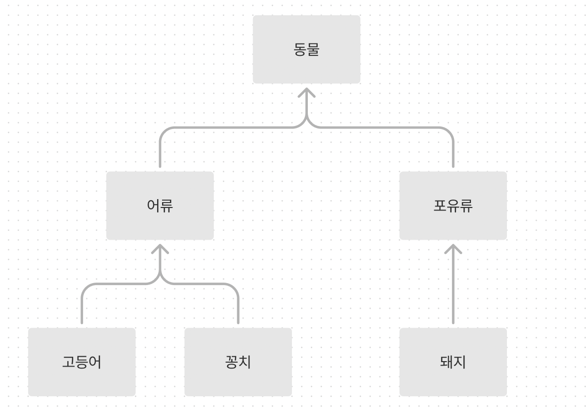
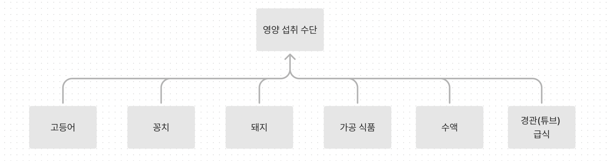

## [13장] 모델링 : 클래스 설계의 토대
### 1. 악마를 불러들이기 쉬운 User 클래스
### 2. 모델링로 접근해야 하는 구조
- 시스템이란?
  - 수많은 구성 요소로 이루어진 집합체로서, 각각의 부분이 유기적으로 연결되어, 전체적으로 하나의 목적을 갖고 움직이는 것
- 시스템 구조와 모델링
  - 모델 : 특정 목적 달성을 위해 최소한으로 필요한 요소를 갖춘것 
- 소프트웨어 설계와 모델링
### 3. 안좋은 모델의 문제점과 해결방법
- user와 시스템의 관계
  - user는 시스템 사용자
- 가상 세계를 표현하는 정보 시스템
- 목적별로 모델링하기
  - 사용자를 표현하는 수단은 목적에 따라 이름과 형태가 달라진다. 절대 하나가 아니다!
- 모델은 대상이 아니라 목적 달성의 수단
- 단일 책임이란 단일 목적
  - 클래스가 이루어야 하는 목적은 반드시 하나여야 한다.
- 모델을 다시 확인하는 방법
  - 해당 모델이 달성하려는 목적을 모두 찾아냅니다.
  - 목벅 별로 모델링을 다시 수정합니다.
  - 목적 중심 이름 설계를 기반으로 모델에 이름을 붙입니다.
  - 모델에 목적 이외의 요소가 들어가 있다면 다시 수정합니다.
- 모델과 구현은 반드시 서로 피드백하기
### 4. 기능성을 좌우하는 모델링
- 숨어 있는 목적 파악하기
- 상품 등의 매매 계약은 구매 회원의 구매 신청에 대하여 회사 또는 판매 회원이 승낙의 의사 표시를 함으로써 체결되다는 약관을 통해 상품 구매는 매매 계약이며, 매매 계약은 계약 체결 일시, 인도 희망일, 지불 기일, 결제 방법을 포한한다. 
  - 상품 구입, 구입 품목 -> 매매 계약, 목적물
- 기능성을 혁신하는 깊은 모델
  - 생물학적인 분류 (각 모델이 어떤 역할을 하는지 알 수 없다.)
    
  - 목적에 따른 분류 (어떤 목적을 달성하기 위한 수단)
    
